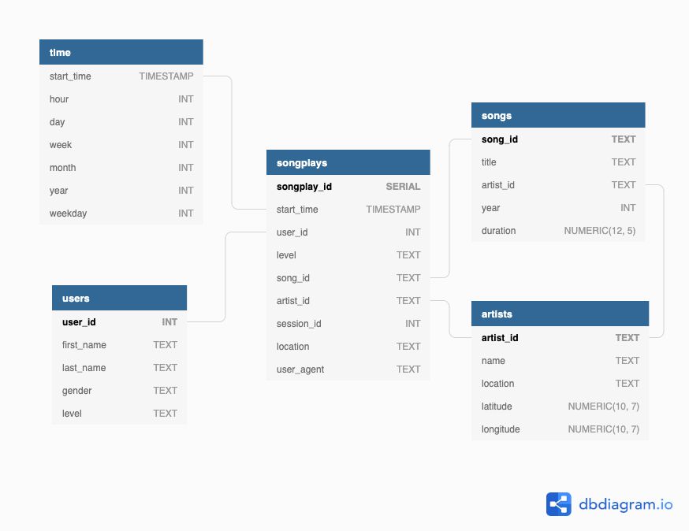

# Sparkify Songs Plays Analytics Database & ETL

## Objectives

Purpose of this database is to enable Sparkify analytics team to conduct song play analysis using the data collected on songs and user activity on Sparkify music streaming app.

## Database & ETL

### Database Schema

Start schema desing in Postgres database was chosen for this project for the follwing reasons:
- The purpose is to run analytical type of queries
- Support for JOINs across different tables is required
- Small dataset
- Semi-structured source data

Because the main goal is to analyze song plays, `songplays` factual table was designed as the center of the schema with foreign keys referencing `songs`, `artists` and `users` tables. Additionally, `time` table was created with timestamps of records in songplays broken down into specific units, that makes it easier to do time-based aggregations.



### ETL Pipeline

ETL pipeline consists of two steps:
- process song data files and populate `songs` and `artists` tables
- process log data files and `users`, `time` and `songplays` tables

Song data json files are expected to conain one record per file and this data is used to populate `songs` and `artists` tables. Files are read and corresponding records are added to `songs` and `artists` tables one at a time.

Log data json files contain multiple records per file. Log data files are processed one by one and records are added to `users`, `time` and `songplays` tables. In order to populate `songplays.song_id` and `songplays.artist_id` columns a select query is executed for each row before it's inserted into databse, which looks for exact match by song title, duration and artist name.

## Repo Structure
- `sql_queries.py` contains all SQL statements, including all drop, create, insert and select queries
- `create_tables.py` script drops and re-creates all tables defined in the schema
- `etl.py` script reads all .json files under the `data` folder, processes each record accordingly and populates the tables in the schema

The `data` folder contains two subdirectories: 
- `song_data` which contains data about songs and artists, that is used to populate corresponding `songs` and `artists` tables
- `log_data` which contains timestamped logs about the usage of the app, that is used to populate `users` table as well as `songplays` and `time` tables

## How to run ETL Pipeline
In order to reset any existing tables, the following command can be executed:

    python create_tables.py 

Executing `etl.py` will process files under `data` directory and populate the tables:

    python etl.py
    
## Example Queries and Results

Example query to select top 10 most popular songs of the year 2018:
```
SELECT artists.name as artist, songs.title as song, count(*) as num_plays
FROM songplays sp
JOIN songs ON songs.song_id = sp.song_id
JOIN artists ON artists.artist_id = sp.artist_id
JOIN "time" ON "time".start_time = sp.start_time
WHERE "time".year = 2018
GROUP BY 1,2
ORDER BY 3 DESC
LIMIT 10;
```
Sample output:
```
 artist |      song      | num_plays 
--------+----------------+-----------
 Elena  | Setanta matins |         1
(1 row)
```


